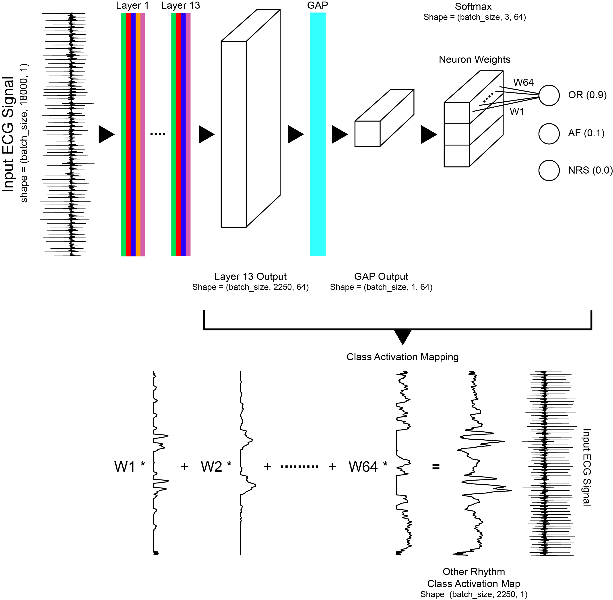

# Deep ECG
In this study, a deep convolutional neural network was trained to classify single lead ECG waveforms as either 
Normal Sinus Rhythm, Atrial Fibrillation, or Other Rhythm. The study was run in two phases, the first to generate a 
classifier that performed at a level comparable to the top submission of the 
[2017 Physionet Challenge](https://www.physionet.org/challenge/2017/), and the second to extract class activation 
mappings to help better understand which areas of the waveform the model was focusing on when making a classification. 

The convolutional neural network has 13 layers, including dilated convolutions, max pooling, ReLU activation, batch
normalization, and dropout. Class activation maps were generated using a global average pooling layer before the 
softmax layer. The model generated the following average scores, across all rhythm classes, on the validation dataset: 
precision=0.84, recall=0.85, F1=0.84, and accuracy=0.88. 

## Dataset
In the [2017 Physionet Challenge](https://www.physionet.org/challenge/2017/), competitors were asked to build a model to 
classify a single lead ECG waveform as either Normal Sinus Rhythm, Atrial Fibrillation, Other Rhythm, or Noisy. The 
dataset consisted of 12,186 ECG waveforms that were donated by AliveCor. Data were acquired by patients using one of 
three generations of [AliveCor](https://www.alivecor.com/)'s single-channel ECG device. Waveforms were recorded for an 
average of 30 seconds with the shortest waveform being 9 seconds, and the longest waveform being 61 seconds. The figure 
below presents examples of each rhythm class and the [AliveCor](https://www.alivecor.com/) acquisition device.

Download Training Dataset: [training2017.zip](https://www.physionet.org/challenge/2017/training2017.zip) 

 
*Left: AliveCor hand held ECG acquisition device. Right: Examples of ECG recording for each rhythm class, 
Goodfellow et al. (2018).*

## Class Activation Maps
Zhou et al. (2016) demonstrate that convolutional neural networks trained for image classification appear to behave as 
object detectors despite information about the object's location not being part of the training labels (no bounding box 
annotations). Zhou et al. (2016)'s formulation was designed for analysis of images whereas our application is time 
series. For our application, the class activation map for a particular rhythm class was used to indicate the 
discriminative temporal regions, not spatial regions, used by the convolutional neural network to identify that rhythm
class. Our work is a direct adaptation of Zhou et al. (2016)'s formulation for time series data.

 
*Class activation map formulation, Goodfellow et al. (2018).*

## Publications
1. Goodfellow, S. D., A. Goodwin, R. Greer, P. C. Laussen, M. Mazwi, and D. Eytan, Towards understanding ECG rhythm 
classification using convolutional neural networks and attention mappings, Machine Learning for Healthcare, Aug 17–18, 
2018, Stanford, California, USA. 

## Research Affiliations
1. The Hospital for Sick Children  
Department of Critical Care Medicine   
Toronto, Ontario, Canada

2. Laussen Labs  
www.laussenlabs.ca   
Toronto, Ontario, Canada

## License
[MIT](LICENSE.txt)

## References
1. B. Zhou, A. Khosla, A. Lapedriza, A. Oliva, and A. Torralba. Learning Deep Features for Discriminative Localization. 
CVPR, 2016. [DOI](https://arxiv.org/pdf/1512.04150.pdf)

2.	Goodfellow, S. D., A. Goodwin, R. Greer, P. C. Laussen, M. Mazwi, and D. Eytan (2018), Atrial fibrillation 
classification using step-by-step machine learning, Biomed. Phys. Eng. Express, 4, 045005. 
[DOI: 10.1088/2057-1976/aabef4](http://iopscience.iop.org/article/10.1088/2057-1976/aabef4) 
